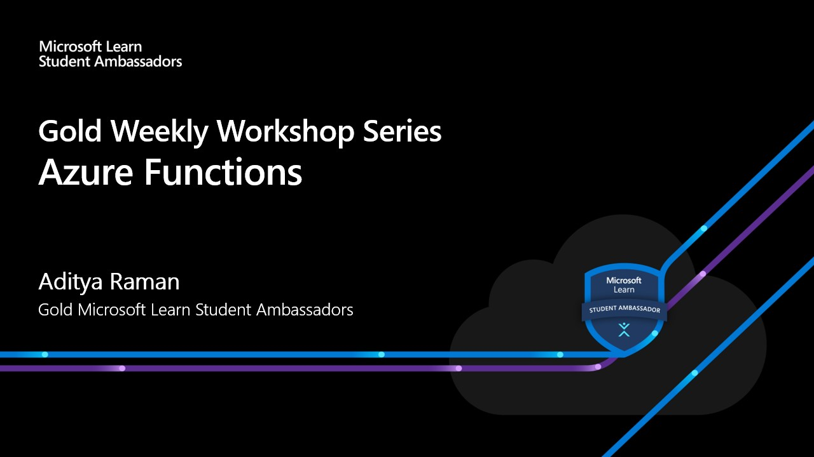

# Gold Weekly Workshop Series - Azure Functions

## Benefits of Attending the Session

- How to prepare for the workshop?
- What is Serverless Computing and how does it works?
- When and where do we need to use Azure Functions?
- Learn to Build a web API
- Resources to start with.

> Language: JavaScript, Python

## Schedule:
- Train the Trainer (5 min)
- Serverless Computing (15 min)
- Azure Functions with hands-on mini-project (30 min)
- QnA (10 min)

## Resources
##### Serverless with GraphQL on Azure Functions
- https://medium.com/@ramanaditya/serverless-with-graphql-c0bf59078303 
- https://ramanaditya.medium.com/seasons-of-serverless-lovely-ladoos-8769724ef618
##### Azure
- https://azure.microsoft.com/en-in/solutions/serverless/ 
##### Azure Functions
- https://github.com/microsoft/AcademicContent/tree/master/Labs/Azure%20Services/Azure%20Functions 
##### For serverless templates
- https://www.serverless.com/
##### Microsoft Learn Modules
- https://docs.microsoft.com/en-us/learn/paths/create-serverless-applications/
- https://docs.microsoft.com/en-us/learn/modules/create-serverless-logic-with-azure-functions/
- https://docs.microsoft.com/en-us/learn/modules/build-api-azure-functions/
- https://docs.microsoft.com/en-us/azure/azure-functions/create-first-function-vs-code-python
